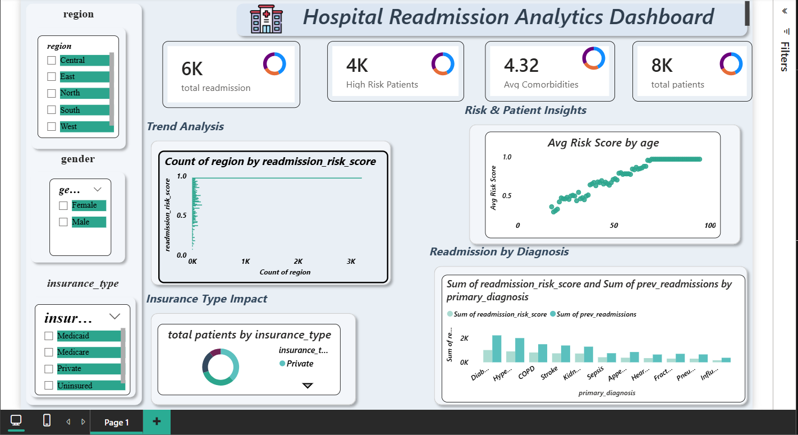

# 🏥 Hospital Readmission Analytics Dashboard

An interactive **Power BI dashboard** designed to analyze hospital readmission patterns and identify key factors influencing patient readmissions.

The dashboard provides insights into patient risk levels, diagnosis impact, and regional readmission trends to support better healthcare decision-making.

---

## 📊 Dashboard Overview

This project analyzes hospital readmission data and highlights important metrics such as:

- Total Patients
- Total Readmissions
- Readmission Rate
- Average Length of Stay
- High Risk Patients

---

## 📈 Key Features

- Interactive slicers for:
  - Region
  - Gender
  - Insurance Type
  - Primary Diagnosis

- KPI cards showing important healthcare metrics
- Trend analysis of readmissions by region
- Risk score analysis by patient age
- Diagnosis-based readmission insights
- Insurance type impact visualization

---

## 🔗 Live Dashboard

Click below to view the interactive dashboard:

👉 **[View Power BI Dashboard](https://tinyurl.com/y32t848x)**

---

## 🛠 Tools Used

- Power BI
- DAX
- Data Modeling
- Data Visualization

---

## 📷 Dashboard Preview

---

## 🎯 Project Objective

The goal of this project is to demonstrate how healthcare data can be transformed into actionable insights using modern data visualization tools.

---

⭐ If you find this project helpful, feel free to give the repository a star.
